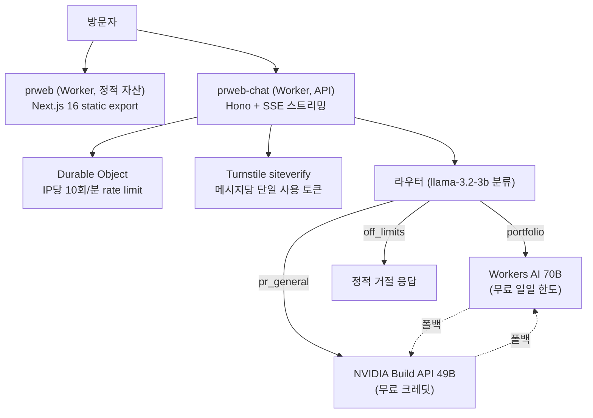

# prweb — 신호정 포트폴리오

> **15년 실서비스 경험으로 On-Device AI를 만듭니다.**
> https://prweb.yopkigom.workers.dev

연간 운영비 **0원** 제약 아래에서 설계한 개인 PR 홈페이지입니다.
정적 사이트와 LLM 챗봇(Ask AI)을 Cloudflare 엣지에서 서빙합니다.

## 아키텍처



- **3단 깊이 콘텐츠 구조**: 카드 한 줄 훅(L1) → 문제/역할/성과(L2) → Technical Deep Dive MDX(L3)
- **챗봇 비용 라우팅**: 경력 질문은 무료 한도(Workers AI), 도메인 밖 PR 질문만 소진형 크레딧(NVIDIA), 개인 신상 질문은 LLM 호출 없이 차단
- **남용 방지**: Turnstile(브라우저 단일 사용 토큰) + Durable Object 슬라이딩 윈도우 rate limit + 입력 검증

## 기술 스택

| 영역 | 선택 |
|---|---|
| Frontend | Next.js 16 (static export) · TypeScript · Tailwind CSS v4 · @next/mdx |
| Hosting | Cloudflare Workers 정적 자산 (`prweb`) |
| Chat API | Cloudflare Workers + Hono (`prweb-chat`), SSE 스트리밍 |
| LLM | Workers AI (llama-3.3-70b-fast, llama-3.2-3b) · NVIDIA Build API (nemotron-super-49b) |
| 보호 | Cloudflare Turnstile · Durable Objects (SQLite) |
| CI/CD | GitHub Actions → wrangler deploy (main push 시 자동) |
| Analytics | Cloudflare Web Analytics |

## 리포 구조

```
apps/
├─ web/                     Next.js 사이트
│  ├─ src/data/projects.json    L1·L2 콘텐츠 스키마
│  ├─ src/content/projects/     L3 딥다이브 MDX
│  └─ wrangler.jsonc            assets 전용 Worker 설정
└─ chat-worker/             챗봇 API Worker
   ├─ src/index.ts              라우팅·스트리밍·보호 로직 전체
   └─ src/context.json          챗봇 주입용 프로필 컨텍스트
docs/
├─ PLAN.md                  단계별 계획·운영 기록
└─ content-source/          원문 콘텐츠 (노션 아카이브 복원본)
```

## 엣지 제약에서 실측으로 배운 것

이 사이트 자체가 "제한된 자원 안에서의 트레이드오프 설계" 연습장입니다.
자세한 과정은 [Ask AI 제작기](https://prweb.yopkigom.workers.dev/projects/ask-ai-behind-the-scenes/)에 정리했습니다.

- NVIDIA 무료 티어에서 llama-3.3-70b는 응답 없이 무한 대기 → 격리 테스트로 원인을 좁혀 nemotron-super-49b로 교체 (엣지 실측 0.6초)
- Workers의 실험적 ratelimit 바인딩은 요청을 전혀 거부하지 않음(실측) → Durable Object 슬라이딩 윈도우로 재구현
- 배포 직후 검증은 엣지 전파 지연 때문에 거짓 음성을 만듦 → 전파 대기 후 재검증을 절차화

## 로컬 개발

```bash
# 사이트
cd apps/web && npm install && npm run dev

# 챗봇 Worker (Workers AI 원격 바인딩 사용)
cd apps/chat-worker && npm install && npm run dev
```

배포는 main 브랜치 push 시 GitHub Actions가 자동 수행합니다.
시크릿: `NVIDIA_API_KEY`, `TURNSTILE_SECRET` (wrangler secret) · `CLOUDFLARE_API_TOKEN`, `CLOUDFLARE_ACCOUNT_ID` (GitHub Actions).
